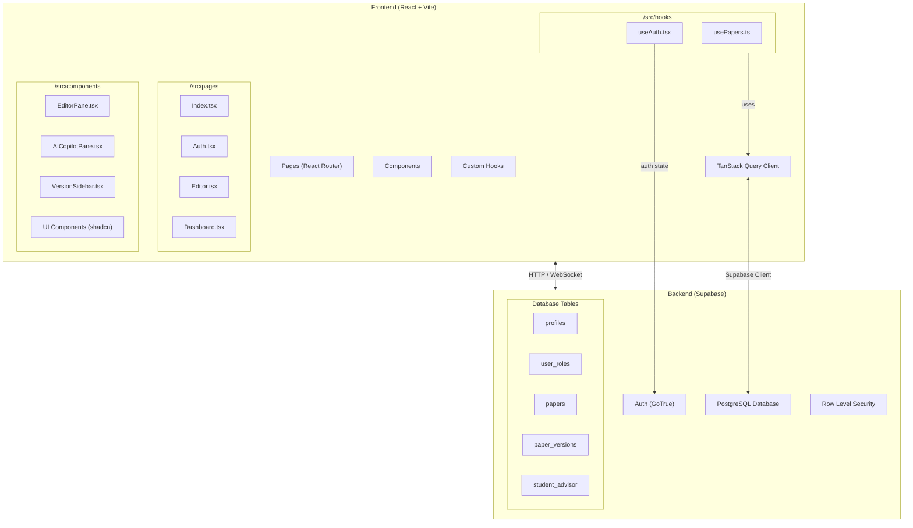
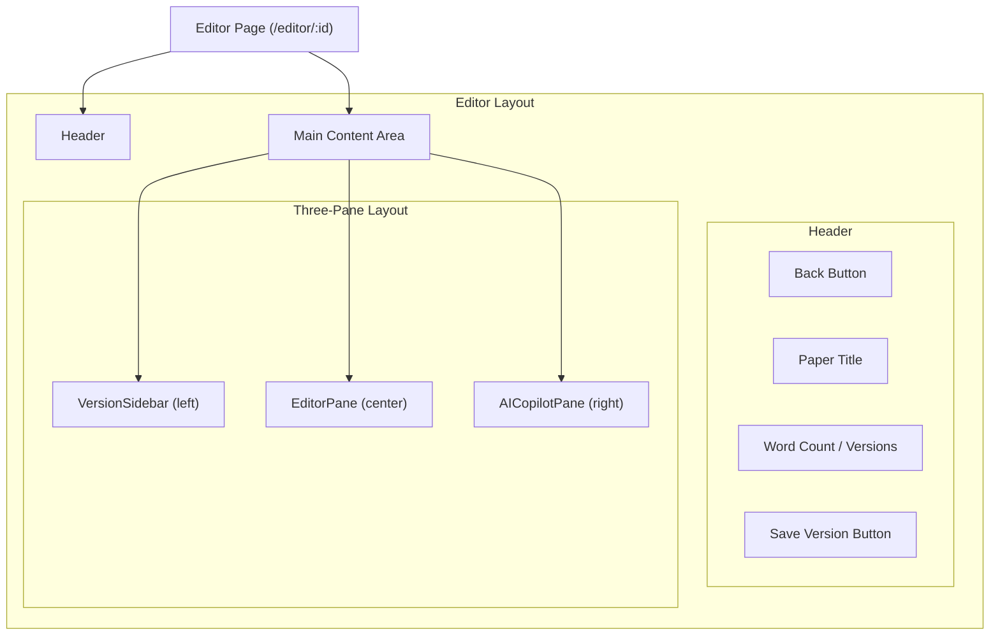
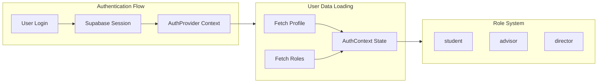
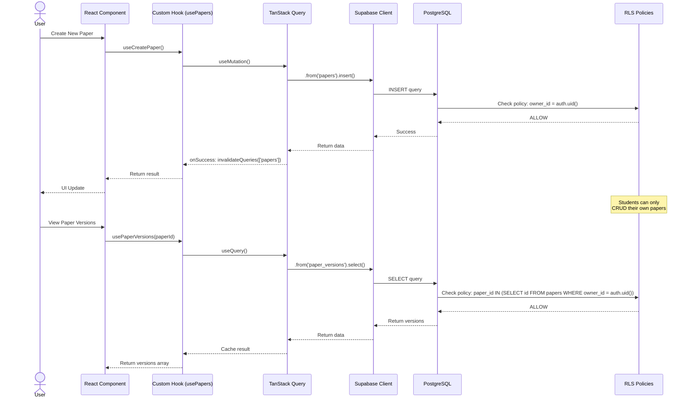
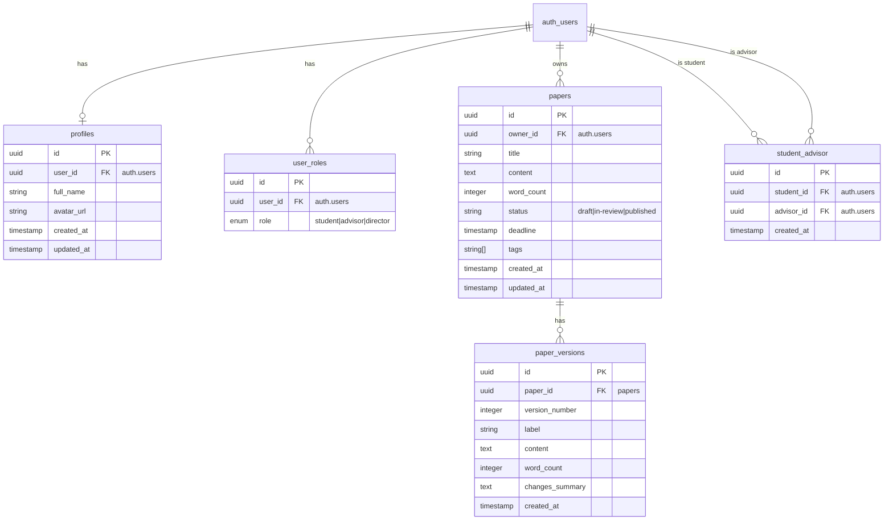
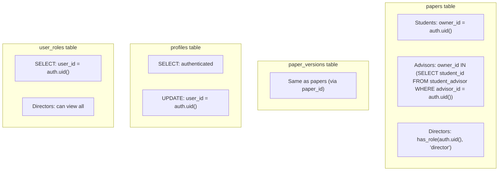
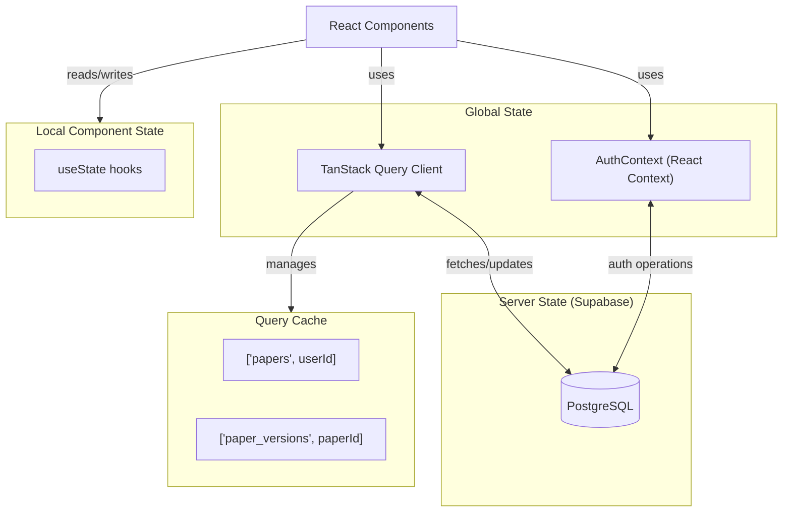
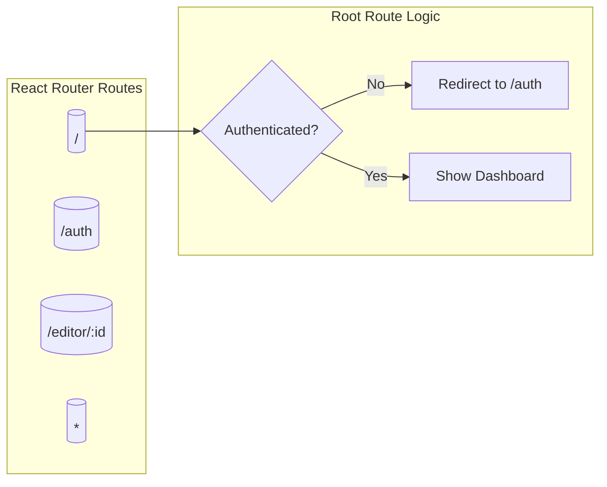
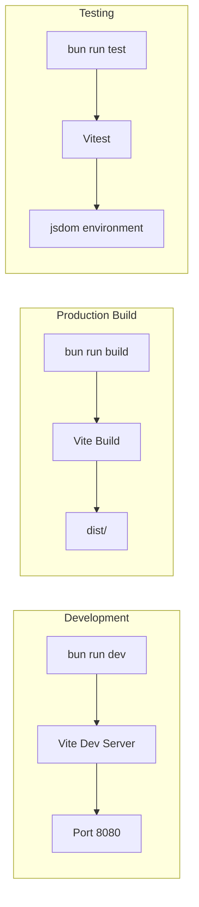

# Architecture Diagrams

## System Overview

## Component Hierarchy - Editor Page

## Authentication & Role System

## Data Flow - Paper Operations

## Database Schema with Relationships

## Row Level Security (RLS) Policies

## State Management Flow

## Route Structure

## Build & Deploy Pipeline

